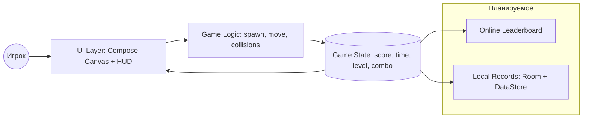

# GameBugs

## Описание проекта
GameBugs — аркадная Android-игра, в которой нужно как можно быстрее тапать по бегающим жукам и зарабатывать очки.
Цель: набрать максимум за ограниченное время, прокачать реакцию и соревноваться с друзьями.

Игровая механика (базовая версия):
- Жуки появляются и хаотично двигаются по полю
- Тап по жуку приносит очки (разные типы могут давать разные значения)
- Серия попаданий без промахов повышает комбо-множитель
- Промах может сбрасывать комбо или отнимать очки
- С ростом уровня увеличиваются скорость и количество жуков
- Бонусные жуки могут давать спец-эффекты (ускорение, заморозка времени и т.д.)

## Стек технологий
- **Язык:** Kotlin
- **UI:** Jetpack Compose, Material 3
- **Архитектура:** Разделение на слои UI / Game Logic / State
- **Навигация:** Navigation Compose
- **План / будущее:** 
  - Retrofit / OkHttp (для онлайн-таблицы лидеров)
  - KSP (уже подключён для возможного использования в будущем)

## Особенности реализации
- Полностью декларативный UI на Jetpack Compose
- Игровой цикл построен на `LaunchedEffect` / `remember` состояниях и кадровых тикерах
- Адаптивная сложность (увеличение скорости спрайтов от настроек в главныом меню)
- Простой расширяемый объектный слой для разных типов "жуков" (обычный, быстрый, бонусный)
- Дополнительные эффекты при нажатии на бонусных жуков, такие как: гравитация (акселерометр), расчитываемая награда в завивисомти от курса золота ЦБ РФ

## Структура проекта
```text
com/example/gamebugs/
├── GameApplication.kt   # Точка инициализации приложения (DI, конфигурация)
├── MainActivity.kt      # Хост-активити: навигация, установка Compose-контента
├── dataBase/            # Слой локальных данных (Room)
│   ├── AppDatabase.kt   # Абстракция RoomDatabase, регистрация DAO
│   ├── dao/             # Интерфейсы доступа к данным
│   ├── model/           # Room Entity
│   └── repository/      # Реализация репозиториев поверх DAO
├── model/               # Доменные / игровые модели (Bug, BugType, GameState)
├── network/             # Сетевой слой (Retrofit сервисы для лидербордов или валют)
├── ui/                  # Compose UI:
│   ├── config/          # Навигация и экраны
│   ├── components/      # Переиспользуемые UI-компоненты (HUD, таймер, кнопки)
│   └── theme/           # Цвета, типографика, стили (Material3)
```

## Архитектура



Логический поток:
1. UI вызывает методы ViewModel.
2. ViewModel использует репозиторий (и/или игровой движок) для обновления состояния.
3. Репозиторий работает с Room (через DAO) или сетью.
4. Game Logic изменяет `GameState`, который через ViewModel переходит обратно в UI.

### Game Logic
- Менеджер спавна: частота появления жуков зависит от уровня
- Движок движения: случайные векторы + столкновения с границами
- Обработка попаданий: обновление счёта, комбо, триггеры анимаций
- Таймер раунда: отсчёт времени, окончание игры

### UI (Compose)
- Игровое поле (Canvas / Box с динамическим слоем спрайтов)
- HUD: время, счёт, комбо, текущий уровень
- Экран итога: финальный счёт + кнопка "Сыграть снова"

### Data Base (Room)
- Игроки (личные данные, уровень сложности)
- Рекорды (лучший счёт каждого зарегестрированного игрока)


## Roadmap
- [ ] Обработка тапов + комбо
- [ ] Таблица рекордов (онлайн)
- [ ] Звуковые эффекты (попадание, уровень ап)
- [ ] Настройки (звук, вибрация)
- [ ] Темная тема / динамические цвета
- [ ] UI-тесты на стабильность кадров
- [ ] Оптимизация (recomposition / draw performance)
- [ ] Профилирование (Jank / Layout Inspector)
- [ ] Достижения и прогресс

## Тестирование (план)
- Unit: расчёт комбо, начисление очков, повышение уровня
- UI: корректность отображения счёта и таймера
- Performance: стабильность при большом числе объектов
